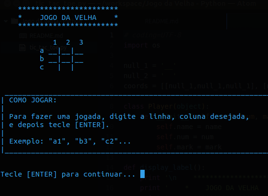

# Jogo da Velha em Python
Esse projeto foi um exercício de fixação. Depois de uma boa estudada na linguagem Python, achei interessante ver algo que aprendi executando no terminal do Linux.

## Funcionamento atual
* Primeiramento, dois jogadores digitam seus nomes;
* Em, seguida, as instruções do jogo são apresentadas;
* E o jogo segue até alguém vencer ou até dar empate.

## Ilustração

